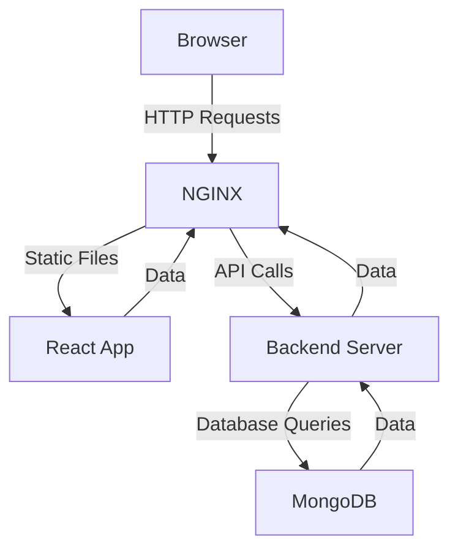

# DevInsight 

**AI-Powered GitHub Repository Analysis Tool**

[](https://maaz404.github.io/Devinsight)
[](https://nodejs.org/)
[](https://reactjs.org/)

A full-stack MERN application that analyzes GitHub repositories across multiple dimensions: documentation quality, dependency health, code quality, and repository metrics.

##  Features

- **📄 README Analysis** - Documentation completeness and structure evaluation
- **📦 Dependency Health** - Package security and maintenance status checking
- **🐛 Code Quality** - Function complexity and design pattern analysis
- **📊 GitHub Metrics** - Repository popularity and community engagement
- **📱 Mobile Responsive** - Optimized for all devices with dark/light themes
- **⚡ Real-time Analysis** - Live progress tracking with detailed results

##  User Interface

DevInsight features a **Neo-Brutalist design** that makes repository analysis both functional and visually engaging:

- **🎪 Bold Visual Design** - Sharp contrasts, vibrant colors, and playful tilted elements
- **💫 Smooth Animations** - Hover effects, CSS transitions, and micro-interactions
- **🎯 Interactive Components** - Custom score meters, animated progress bars, and responsive cards
- **📱 Mobile-First** - Touch-friendly interface optimized for all screen sizes
- **🎭 Playful Elements** - Emoji-rich content, tilted cards, and engaging visual feedback

The interface combines professional functionality with a modern, approachable aesthetic that makes complex repository data easy to understand and navigate.

##  Quick Start

### Prerequisites

- Node.js 18+
- GitHub Personal Access Token (recommended)

### Installation

```bash
# Clone repository
git clone https://github.com/maaz404/Devinsight.git
cd Devinsight

# Backend setup
cd server
npm install

# Frontend setup
cd ../client
npm install

# Environment configuration
# Create server/.env with:
GITHUB_TOKEN=your_github_token_here
MONGODB_URI=your_mongodb_uri_here (optional)
PORT=5000

# Start application
# Terminal 1 - Backend
cd server && npm start

# Terminal 2 - Frontend
cd client && npm run dev
```

Access at: `http://localhost:5173`

##  Tech Stack

**Frontend:** React 18, Vite, Ant Design, Tailwind CSS  
**Backend:** Node.js, Express.js, MongoDB Atlas  
**APIs:** GitHub REST API, npm Registry
**Containerization:** Docker, Docker compose
**Reverse Proxy:** Nginx

## 🚀 Docker & NGINX Integration

This fork adds Docker containerization and an NGINX reverse proxy for production-ready deployment.

### 📦 How to Run with Docker

1. Build and start containers:
   ```bash
   docker-compose up --build
   ```
    Access the app:

        Frontend: http://localhost:3000

        Backend: Exposed internally to NGINX, no direct local access.

⚙️ System Architecture

    Browser → NGINX → Backend
    NGINX handles static React files at / and proxies API calls at /api/* to the backend service.

Benefits of this architecture:
- **Scalability**: Each component can be scaled independently.
- **Separation of Concerns**: Clear separation between frontend, backend, and database.

Benefits of using nginx reverse proxy:
- **Performance**: NGINX serves static files efficiently, reducing load on the backend.
- **Security**: NGINX can handle SSL termination and protect backend services from exposing them publically.

### Issues Resolved while containerization and nginx config
1) Nginx can't forward the proxy to backend
STEPS TO RESOLVE THE ISSUE:
--> Checked the logs of server container
```bash
docker compose logs server
```
--> Executing the curl request to backend inside the nginx container by exec it in interactive environment in shell  
```bash
docker exec -it <container_id_of_client> sh
curl http://server:5000/api/analyze/test
```
--> Sending the fake request to backend from local frontend served using nginx
--> Check the logs of client container
```bash
docker compose logs client
```
--> Noticed the relative path error nginx was trying to forward the request on http://server:5000/analyze which is incorrect path.
--> Change the proxy_pass in nginx config to use /api/analyze

2) server can't establish connection with mongodb
--> checked the mongodb_uri (used the service name instead of hardcoded ip)
--> Server was trying to connect to devinsight database which is not the database in which admin credential were stored.
--> changed the mongo db uri to use query 'authsource=admin'

##  API Usage

**POST** `/api/analyze`

```json
{
  "repoUrl": "https://github.com/username/repository"
}
```

Returns comprehensive analysis with scores for README quality, dependency health, code quality, and GitHub metrics.

##  Getting Zero Scores?

If your **GitHub Metrics** or **Code Quality** scores show 0:

1. **Add GitHub Token**: Copy `server/.env.example` to `server/.env`
2. **Get Token**: [GitHub Settings](https://github.com/settings/tokens) → Generate new token → Copy
3. **Update .env**: Replace `your_actual_token_here` with your token
4. **Restart**: `npm start` in server directory

See [GITHUB_TOKEN_SETUP.md](GITHUB_TOKEN_SETUP.md) for detailed instructions.

##  Contributing

1. Fork the repository
2. Create your feature branch (`git checkout -b feature/amazing-feature`)
3. Commit your changes (`git commit -m 'Add amazing feature'`)
4. Push to the branch (`git push origin feature/amazing-feature`)
5. Open a Pull Request

##  License

MIT License - see [LICENSE](LICENSE) file for details.

---

Built with ❤️ for developers by developers
